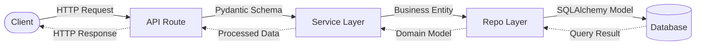
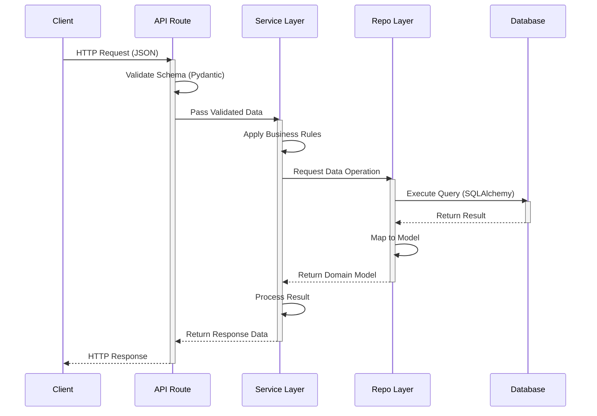

# WAGFU - Service Backend Architecture

Developer: Carbonite13  
Version: 1.0.0  
Date: 2026-04-26

# Architecture Overview

This documents the high-level architecture of the WAGFU backend service.
it has been designed to enforce the following as per industry standards and best practices,
regarding FastAPI python.

structure should represent

- clear seperation of concerns
- database abstraction (sqlite3/PostgreSQL)
- scalabale modular growth
- clean migration handling(alembic)

## FileSystem Tree

The backend service is structured into the following folders:

```
./
│
├── api/
│   └── routes/
│       └── v1/
│           ├── auth.py
│           ├── user.py
│           ├── pet.py
│           ├── pet_addons.py
│           └── exception_handler.py
│
├── core/
│   ├── exceptions.py
│   └── security.py
│
├── db/
│   ├── dependencies.py
│   ├── session.py
│   └── migrations/
│
├── models/
│   ├── user.py
│   ├── pets.py
│   └── doctor_profile.py
│
├── repo/
│   ├── user.py
│   ├── pet.py
│   ├── vaccination.py
│   └── medical_record.py
│
├── schemas/
│   ├── user.py
│   ├── pets.py
│   ├── pet_addons.py
│   └── doctor.py
│
├── services/
│   ├── jwt/
│   │   ├── helper.py
│   │   └── master.py
│   ├── pet.py
│   ├── user.py
│   └── pet_addons.py
│
├── tests/
│   ├── test_user.py
│   ├── test_auth.py
│   ├── test_pet.py
│   ├── test_pet_addons.py
│   └── test_medical_record.py
│
├── alembic.ini
├── README.md
├── requirements.txt
└── main.py
```

---

### main.py

The entry point to the service, responsible for handling and linking Application bootstrapping, Middleware registration and router inclusion.

### core/

Central configurations and infrastructure, handling environment variables, database connections, and security configurations.

- config.py - handling all application configurations and envrionment variable reads.
- database.py - handling all database configurations and connection poolings.
- security.py - handling all security related configurations and utilities.
- etc

### models/

Defines the database schema (ORM Layer) using SQLAlchemy(or sqlmodel).
Rules:

- Models should be isolated to their own files (i.e user.py, auth.py, etc).
- Models should not contain any business logic.
- Models should be written as per PEP 8 standards.
- Maps directly to DB Tables.

### schemas/

defines API contracts.

Types,

- request models
- response models

Rules,

- No DB logic
- No persistence concerns

### repo/

encapsulated CRUD operations.

- interact with DB
- isolate query logic
- return ORM objects

### services/

handles business logic

- validation rules
- orchestration accross repos
- domain-specific operations

Rules,

- no direct DB queries
- uses repo/

### api/

structured handling of HTTP requests.

- router.py - aggregate all route modules
- routes/ - all route modules

### routes/

Define endpoints and handle HTTP requests.

Rules,

- thin layer
- no heavy logic
- calls services

### migrations/

managed by alembic, configuration for db migrations

Contains,

- migrations scripts
- revision history

### tests/

Handle unit tests and integrations tests.

- unit tests, services and repo
- integrations tests, api endpoints

# Request Flow

### High-Level Flow



### Detailed Sequence



# Design Characteristics

1. Loose Coupling  
Each layer depends only on one directly above it.

2. Replaceability  
DB can change without affecting API and business logic is independent of persistence.

3. Testability  
Services can be tested with mocked repos.

# Style guides

PEP 484 – Type Hints
PEP 492 – Coroutines with async and await syntax
PEP 526 – Syntax for Variable Annotations
PEP 585 – Type Hinting Generics In Standard Collections (Python 3.9+)
PEP 604 – Allow writing union types as X | Y (Python 3.10+)

# Style guides description

- PEP 484 — Type Hints Introduces optional type hints for Python (function annotations, variable annotations, typing module) and the standard for gradual typing used by type checkers (mypy, pyright).
- PEP 492 — Coroutines with async/await Syntax, Adds async and await syntax to define native coroutines, enabling clearer asynchronous code and integration with the asyncio framework.
- PEP 526 — Syntax for Variable Annotations, Adds syntax for annotating variable types (including module- and class-level variables) without necessarily assigning values, complementing PEP 484.
- PEP 585 — Type Hinting Generics In Standard Collections, Allows using built-in collection types (list, dict, etc.) as generic types directly (e.g., list[int]) instead of typing.List, simplifying annotations in Python 3.9+.
- PEP 604 — Allow writing union types as X | Y, Introduces the pipe operator for union types in annotations (e.g., int | None) as a concise alternative to typing.Union, available in Python 3.10+.
