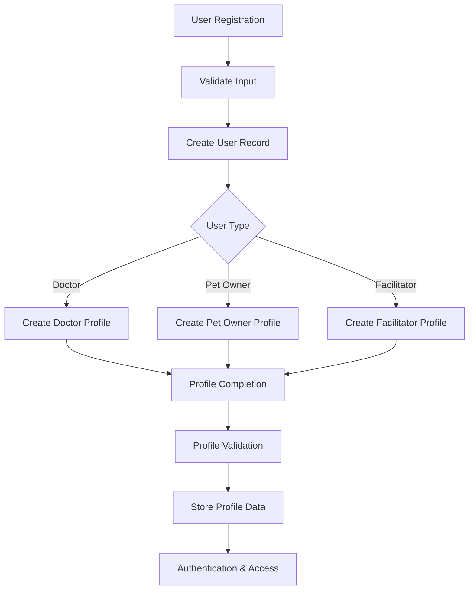
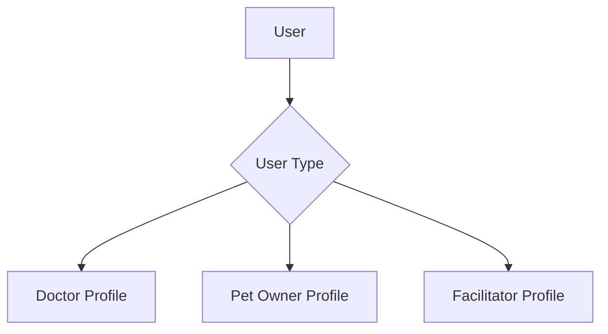
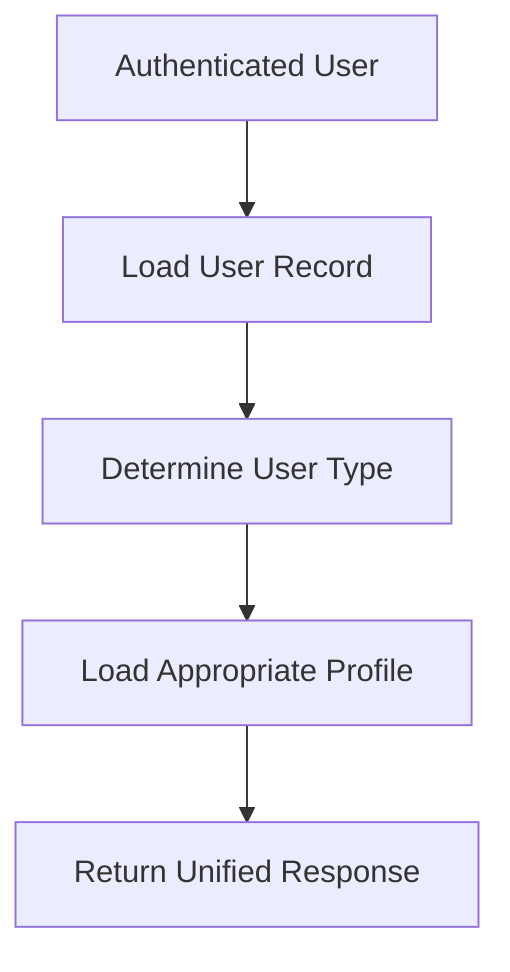

# User Registration and Profile Management Architecture

## Overview

This document describes the architecture for user registration, authentication, and profile management for three user categories:

- Doctor
- Pet Owner
- Facilitator

The architecture separates authentication concerns from profile management concerns. A central User record acts as the source of truth for identity and authentication, while profile information is stored in profile domains corresponding to the selected user type.

---

## User Registration

A user begins registration by providing:

- Display Name
- Email Address
- User Type

The email address must be unique across the platform. The backend validates the request and creates the user identity record.

### PostgreSQL Considerations

- Use a UNIQUE constraint on email addresses.
- Use NOT NULL constraints for mandatory fields.
- Represent user type using a PostgreSQL ENUM.
- Wrap registration operations inside a database transaction.

### SQLAlchemy Considerations

- Use SQLAlchemy Enum mappings for user types.
- Keep validation separate from ORM models.
- Use a single transaction scope for registration and profile creation.

---

## High-Level Registration Flow

When registration is completed, the system validates the submitted information, creates the user identity record, determines the selected user type, provisions the corresponding profile, and proceeds to profile completion.

---

## Profile Architecture

The User entity serves as the central authentication identity. Depending on the selected user type, the user is associated with a Doctor Profile, Pet Owner Profile, or Facilitator Profile.

This separation allows profile-specific requirements to evolve independently while maintaining a consistent authentication system.

---

## Profile Completion

After registration, users are directed to a profile completion workflow.

Profile data originates from two primary sources.

### User-Supplied Information

Examples:

- Address
- Contact Information
- Professional Information
- Profile Details

### System-Supplied Information

Examples:

- Location Data
- Metadata
- Audit Information
- System Generated Attributes

All required profile fields must be completed before a profile is considered active.

---

## Profile Retrieval Flow

When profile information is requested, the system resolves the authenticated user, determines the associated user type, retrieves the correct profile record, and returns a unified response to the frontend.

---

## Authorization Model

Users may:

- View their own profile
- Update their own profile

Administrative users may:

- View all profiles
- Manage user accounts
- Manage profile records

Authorization decisions should be enforced at the service layer before database operations occur.

---

## Security Considerations

The following controls should be considered mandatory:

- Server-side validation for all incoming requests.
- Email uniqueness enforced at the database layer.
- Protection against privilege escalation through strict authorization checks.
- Audit timestamps for creation and modification tracking.
- Transaction-based registration workflows.
- Secure password storage using modern password hashing algorithms.
- Input sanitization and validation.
- Principle of least privilege for database access.
- Proper exception handling to avoid leaking internal system details.
- Rate limiting for authentication-related endpoints.

---

## PostgreSQL Best Practices

- Use foreign key constraints for referential integrity.
- Create indexes on frequently queried columns.
- Use transactional consistency during user creation and profile provisioning.
- Maintain created_at and updated_at audit fields.
- Use migrations for schema management.
- Keep profile and authentication concerns logically separated.

---

## SQLAlchemy Best Practices

- Use declarative ORM models.
- Use typed relationships where appropriate.
- Keep business logic outside ORM models.
- Use session-per-request patterns.
- Use migration tooling such as Alembic.
- Avoid direct database access from presentation layers.

---

## Conclusion

This architecture provides a clear separation between authentication and profile management while supporting Doctor, Pet Owner, and Facilitator user categories. The design emphasizes maintainability, security, transactional consistency, and scalability while remaining understandable to developers, reviewers, and stakeholders.
