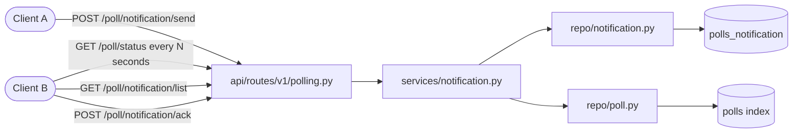
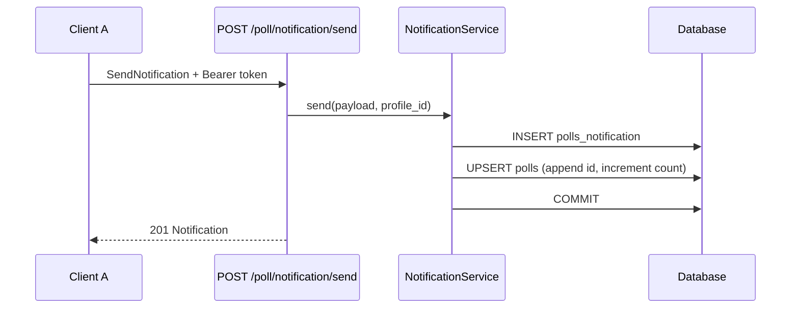

# Notification Module (Short Polling)

## Overview

The notification module implements a **short-polling** delivery pattern. Client A dispatches a notification to client B; client B repeatedly calls `GET /poll/status` on a timer to discover pending work, then fetches full records through `GET /poll/notification/list`.

Three poll categories are defined in the data model (`notification`, `call`, `chat`). The wired implementation currently handles **notification** traffic end-to-end. Call and chat tables exist for future matchmaking and chat-routing work described in [polling.md](./polling.md).



---

## Prerequisites

1. Both users must exist in the `users` table.
2. The caller must present a valid JWT Bearer token with a resolvable `profile_id` (mapped to `users.user_id`).
3. PostgreSQL must be running; poll tables are created at engine startup.

---

## File Map

| Layer | Path | Responsibility |
|-------|------|----------------|
| Routes | `api/routes/v1/polling.py` | HTTP handlers under `/poll` |
| Service | `services/notification.py` | Identity resolution, orchestration, transactions |
| Repos | `repo/notification.py`, `repo/poll.py` | Notification records and poll index maintenance |
| Schemas | `schemas/polling.py`, `schemas/notifications.py` | Request/response contracts |
| Models | `models/polls.py` | `Polls`, `PollNotification`, call/chat stubs |
| Exceptions | `core/exceptions.py` | `NotificationError`, `NotificationNotFoundError`, etc. |

The router is registered in `main.py`.

---

## Data Model

### `polls` — aggregate index

Tracks how many pending records exist per sender/recipient/category. Queried by short polling.

| Column | Type | Notes |
|--------|------|-------|
| `poll_from` | `UUID` | Sender `users.user_id` |
| `poll_to` | `UUID` | Recipient `users.user_id` |
| `poll_type` | `PollType` | `1` notification, `2` call, `3` chat |
| `poll_count` | `int` | Number of pending record ids |
| `poll_id` | `int[]` | Record ids in the detail table |

**Primary key:** (`poll_from`, `poll_to`, `poll_type`)

### `polls_notification` — notification detail

| Column | Type | Notes |
|--------|------|-------|
| `id` | `int` | Auto-increment primary key |
| `poll_from` | `UUID` | Sender |
| `poll_to` | `UUID` | Recipient |
| `content` | `string` | Message body (max 500 chars) |
| `priority` | `int` | `0` (low) – `5` (high), default `5` |
| `read` | `bool` | Set `true` on acknowledge |
| `issue_time` | `date` | Creation date |

### `PollType` values

| Value | Name | Status |
|-------|------|--------|
| `1` | `notification` | Implemented |
| `2` | `call` | Table stub only |
| `3` | `chat` | Table stub only |

---

## Short-Polling Flow

### 1. Client A sends a notification



### 2. Client B polls for pending work

Client B calls `GET /poll/status` on an interval (e.g. every 3–5 seconds). The response is lightweight: sender, type, count, and record ids — enough to decide whether a detail fetch is needed.

```json
{
  "count": 1,
  "status": "success",
  "pending": [
    {
      "poll_from": "a1b2c3d4-e5f6-7890-abcd-ef1234567890",
      "poll_type": 1,
      "poll_count": 2,
      "poll_ids": [4, 7]
    }
  ]
}
```

### 3. Client B fetches details

`GET /poll/notification/list` returns full notification objects sorted by priority (descending), then issue date.

### 4. Client B acknowledges

`POST /poll/notification/ack` removes the record from the poll index. Depending on the action, the detail row is marked read and/or deleted.

---

## API Reference

All endpoints require `Authorization: Bearer <token>`.

### `GET /poll/status`

Short-poll endpoint. Returns pending poll buckets for the authenticated user.

**Query parameters**

| Param | Type | Required | Description |
|-------|------|----------|-------------|
| `poll_type` | int | no | Filter by `PollType` value (`1`, `2`, or `3`) |

**Response:** `200 OK` — `PollStatusResponse`

---

### `POST /poll/notification/send`

Dispatch a notification to another user.

**Request body** (`SendNotification`)

| Field | Type | Required | Constraints |
|-------|------|----------|-------------|
| `recipient_id` | UUID | yes | Target `users.user_id` |
| `content` | string | yes | 1–500 chars |
| `priority` | int | no | 0–5, default 5 |

**Response:** `201 Created` — `Notification`

---

### `GET /poll/notification/list`

Fetch notification detail records for the authenticated recipient.

**Query parameters**

| Param | Type | Default | Description |
|-------|------|---------|-------------|
| `unread_only` | bool | `false` | When `true`, return only unread rows |

**Response:** `200 OK` — `NotificationList`

---

### `POST /poll/notification/ack`

Acknowledge or delete a notification.

**Request body** (`NotificationAck`)

| Field | Type | Required |
|-------|------|----------|
| `notification_id` | int | yes |
| `action` | string | yes |

**Actions**

| Action | Behaviour |
|--------|-----------|
| `ack` | Mark read; remove from poll index; keep detail row |
| `delete` | Remove from poll index; delete detail row |
| `ack-del` | Mark read, remove from index, delete detail row |

**Response:** `200 OK` — `Notification` (for `ack`) or `null` (for `delete` / `ack-del`)

---

## Example Payloads

### Send

```json
{
  "recipient_id": "b2c3d4e5-f6a7-8901-bcde-f12345678901",
  "content": "Your pet vaccination is due tomorrow.",
  "priority": 4
}
```

### Notification response

```json
{
  "id": 7,
  "poll_from": "a1b2c3d4-e5f6-7890-abcd-ef1234567890",
  "issue_time": "2026-06-10",
  "content": "Your pet vaccination is due tomorrow.",
  "priority": 4,
  "read": false
}
```

---

## Identity Resolution

JWT payloads currently carry `profile_id`, not `user_id`. The service resolves the authenticated user through:

```
profile_id (token) → users.profile_id → users.user_id
```

If `profile_id` is missing or unmatched, `NotificationUserError` (`404`) is returned.

---

## Error Handling

| Condition | Exception | HTTP Status |
|-----------|-----------|-------------|
| Unresolved user identity | `NotificationUserError` | 404 |
| Notification not found / not owned | `NotificationNotFoundError` | 404 |
| Self-send attempt | `NotificationAccessError` | 403 |
| Unexpected failure | `NotificationError` | 400 |

Handlers are registered in `exception_handler.py`.

---

## Repository Contract

Both repos follow the project rule: **no commits inside CRUD**. The service owns `commit()` / `rollback()`.

### `repo/notification.py`

| Method | Description |
|--------|-------------|
| `create_notification` | Insert `polls_notification` row |
| `get_by_id` | Lookup by id |
| `list_for_recipient` | All (or unread) notifications for a user |
| `mark_read` | Set `read = true` |
| `delete_notification` | Remove detail row |

### `repo/poll.py`

| Method | Description |
|--------|-------------|
| `list_pending_for_user` | Poll index rows where `poll_to = user` |
| `append_record` | Add id to `poll_id`, update `poll_count` |
| `remove_record` | Remove id; delete index row when count reaches 0 |

---

## Client Integration Guide

Recommended polling loop for client B:

1. Start interval timer (3–5 s recommended; adjust for battery/network).
2. `GET /poll/status` — if `count == 0`, wait for next tick.
3. For each `pending` entry with `poll_type == 1`, call `GET /poll/notification/list?unread_only=true`.
4. Render notifications; on user dismiss, `POST /poll/notification/ack`.
5. On ack, remove from UI; the next poll should show reduced `poll_count`.

```
while app_is_active:
    status = GET /poll/status
    if status.count > 0:
        notifications = GET /poll/notification/list?unread_only=true
        render(notifications)
    sleep(POLL_INTERVAL_SECONDS)
```

---

## Related Documentation

- [polling.md](./polling.md) — original abstract for call/chat/notification routing
- [user_flow.md](./user_flow.md) — platform-wide user interaction model
- [ARCHITECTURE.md](./ARCHITECTURE.md) — layered backend conventions
- [pet_module.md](./pet_module.md) — pet management (separate domain)

---

## Future Work

- Wire `PollType.call` through `polls_calls` for VoIP/matchmaking
- Wire `PollType.chat` through `polls_chat` and `chats`
- Add `user_id` directly to JWT to skip profile lookup
- Server-side long-polling or WebSocket upgrade path
- System-origin notifications (`poll_from` = platform service account)
