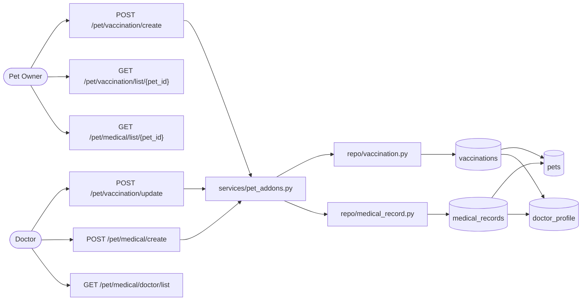
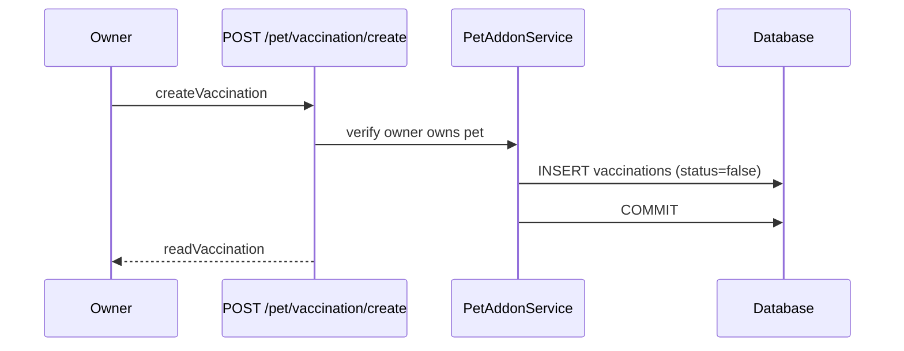
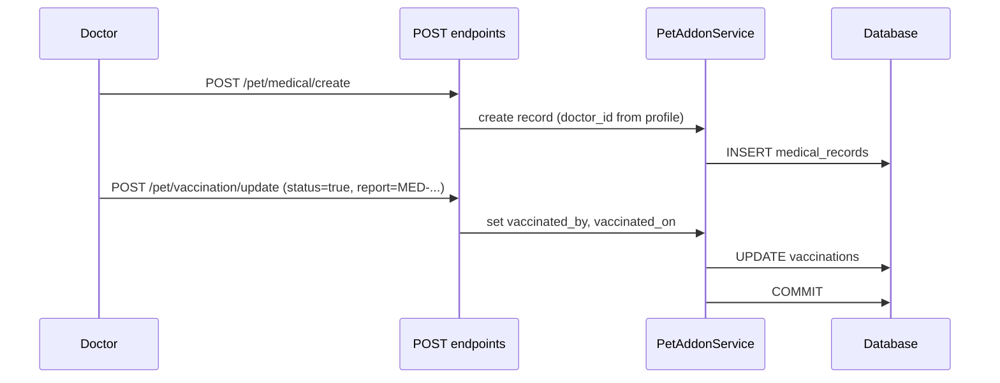

# Pet Add-ons: Vaccinations & Medical Records

## Overview

The pet add-ons module extends the core [pet module](./pet_module.md) with **vaccination scheduling** and **medical record** management. Records are linked to `pets`, doctors are referenced through `doctor_profile.id`, and vaccinations can be completed by a doctor with an optional link to a medical report.



---

## Prerequisites

1. The pet must exist in the `pets` table (`PET-{YYYY}-{NNNNN}`).
2. Callers must present a valid JWT Bearer token with a resolvable `profile_id`.
3. **Owners** (`role: owner`) may schedule vaccinations and read health data for their own pets.
4. **Doctors** (`role: doctor`) may administer vaccinations, author medical records, and read pet health data during treatment.

---

## File Map

| Layer | Path | Responsibility |
|-------|------|----------------|
| Routes | `api/routes/v1/pet_addons.py` | HTTP handlers under `/pet` |
| Service | `services/pet_addons.py` | Role checks, orchestration, transactions |
| Repos | `repo/vaccination.py`, `repo/medical_record.py` | CRUD against ORM models |
| Schemas | `schemas/pet_addons.py` | Request/response contracts |
| Models | `models/pets.py` | `Vaccination`, `MedicalRecords` (wired to `Pets`, `DoctorProfile`) |
| Exceptions | `core/exceptions.py` | `PetAddonError`, `VaccinationNotFoundError`, etc. |

---

## Data Model

### `vaccinations`

| Column | Type | Notes |
|--------|------|-------|
| `pet_id` | `String(15)` | FK → `pets.pet_id` |
| `vaccine` | `String` | Vaccine name; part of composite PK |
| `due_date` | `date` | Scheduled due date |
| `status` | `bool` | `false` = pending, `true` = administered |
| `vaccinated_at` | `String` | Optional facility/clinic id (`CLN-####-#####`) |
| `vaccinated_by` | `String` | FK → `doctor_profile.id`; set when doctor completes |
| `vaccinated_on` | `date` | Administration date |
| `report` | `String` | Optional linked `medical_id` (`MED-####-#####`) |

**Primary key:** (`pet_id`, `vaccine`)

### `medical_records`

| Column | Type | Notes |
|--------|------|-------|
| `medical_id` | `String(15)` | PK; format `MED-{YYYY}-{NNNNN}` |
| `pet_id` | `String(15)` | FK → `pets.pet_id` |
| `doctor_id` | `String` | FK → `doctor_profile.id` |
| `diagnosis` | `String` | Clinical notes |
| `date` | `date` | Record date |

### Relationships

```
PetOwnerProfile ──< Pets >── Vaccination
                    │
                    └── MedicalRecords >── DoctorProfile
```

Vaccination rows cascade-delete with their pet. Medical records cascade-delete with their pet.

---

## Authorization Matrix

| Action | Owner | Doctor |
|--------|:-----:|:------:|
| Schedule vaccination | ✓ (own pets) | ✓ |
| List vaccinations | ✓ (own pets) | ✓ |
| Reschedule `due_date` | ✓ (pending only) | ✓ |
| Mark vaccination administered | ✗ | ✓ |
| Create medical record | ✗ | ✓ |
| List medical records (by pet) | ✓ (own pets) | ✓ |
| List medical records (by doctor) | ✗ | ✓ |
| Update medical record | ✗ | ✓ (own records) |

When a doctor marks `status: true`, `vaccinated_by` is set automatically from their `doctor_profile.id`.

---

## API Reference

All endpoints require `Authorization: Bearer <token>`.

### Vaccinations

#### `POST /pet/vaccination/create`

Schedule a new vaccination (starts as `status: false`).

**Request** (`createVaccination`)

```json
{
  "pet_id": "PET-2026-00042",
  "vaccine": "Rabies",
  "due_date": "2026-07-01"
}
```

**Response:** `201 Created` — `readVaccination`

---

#### `GET /pet/vaccination/list/{pet_id}`

List all vaccination records for a pet.

**Response:** `200 OK` — `list[readVaccination]`

---

#### `POST /pet/vaccination/update`

Update a vaccination record. Allowed fields depend on role (see authorization matrix).

**Owner example** — reschedule only:

```json
{
  "pet_id": "PET-2026-00042",
  "vaccine": "Rabies",
  "due_date": "2026-08-01"
}
```

**Doctor example** — mark administered:

```json
{
  "pet_id": "PET-2026-00042",
  "vaccine": "Rabies",
  "status": true,
  "vaccinated_at": "CLN-2026-00001",
  "vaccinated_on": "2026-06-10",
  "report": "MED-2026-00007"
}
```

**Response:** `200 OK` — `readVaccination`

---

### Medical Records

#### `POST /pet/medical/create`

Doctor-authored diagnosis entry. `doctor_id` is inferred from the token.

**Request** (`createMedicalRecord`)

```json
{
  "pet_id": "PET-2026-00042",
  "diagnosis": "Mild skin irritation, topical treatment prescribed.",
  "date": "2026-06-10"
}
```

**Response:** `201 Created` — `readMedicalRecord`

---

#### `GET /pet/medical/list/{pet_id}`

All medical records for a pet.

**Response:** `200 OK` — `list[readMedicalRecord]`

---

#### `GET /pet/medical/doctor/list`

All medical records authored by the authenticated doctor.

**Response:** `200 OK` — `list[readMedicalRecord]`

---

#### `POST /pet/medical/update`

Update a record. Only the authoring doctor may modify it.

**Request** (`updateMedicalRecord`)

```json
{
  "medical_id": "MED-2026-00007",
  "diagnosis": "Resolved. Follow-up not required."
}
```

**Response:** `200 OK` — `readMedicalRecord`

---

## Service Flows

### Owner schedules a vaccination



### Doctor administers vaccination and links report



---

## ID Formats

| Entity | Format | Example |
|--------|--------|---------|
| Pet | `PET-{YYYY}-{NNNNN}` | `PET-2026-00042` |
| Medical record | `MED-{YYYY}-{NNNNN}` | `MED-2026-00007` |
| Doctor | `DOC-{YYYY}-{NNNNN}` | `DOC-2026-00003` |
| Clinic (optional) | `CLN-{YYYY}-{NNNNN}` | `CLN-2026-00001` |

---

## Error Handling

| Condition | Exception | HTTP Status |
|-----------|-----------|-------------|
| Pet not found / not owned | `PetNotFoundError` / `PetAddonAccessError` | 404 / 403 |
| Vaccination not found | `VaccinationNotFoundError` | 404 |
| Medical record not found | `MedicalRecordNotFoundError` | 404 |
| Duplicate vaccine schedule | `PetAddonError` | 400 |
| Owner tries to administer vaccine | `PetAddonAccessError` | 403 |
| Non-doctor creates medical record | `PetAddonAccessError` | 403 |
| Unexpected failure | `PetAddonError` | 400 |

---

## Model Notes

The following minimal adjustments were made to `models/pets.py` to support wiring:

- **Vaccination** composite PK (`pet_id`, `vaccine`) to allow multiple vaccines per pet
- **Vaccination** `vaccinated_at` stored as a plain string (clinic table not yet implemented)
- **Vaccination** relationship target corrected to `Pets`
- **MedicalRecords** `pet_id` FK added to `pets.pet_id`
- **DoctorProfile** relationships added on both health record models

The core `Pets` table structure is unchanged.

---

## Related Documentation

- [pet_module.md](./pet_module.md) — pet CRUD and owner linkage
- [user_flow.md](./user_flow.md) — platform flow: pets → vaccinations → medical records
- [notification.md](./notification.md) — reminder delivery (e.g. vaccination due alerts)
- [ARCHITECTURE.md](./ARCHITECTURE.md) — layered backend conventions

---

## Future Work

- Auto-notify owners when `due_date` approaches (integrate with notification module)
- Clinic model and FK validation for `vaccinated_at`
- ETL pipeline for parsing uploaded medical documents (noted in model comments)
- Soft-delete and audit trail for medical records
- Doctor verification gate before record authoring
