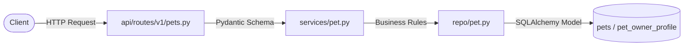
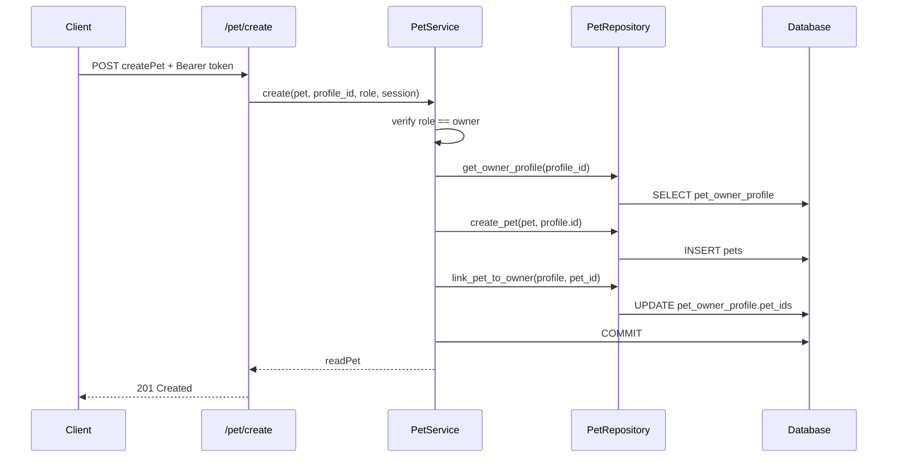

# Pet Module

## Overview

The pet module lets authenticated **pet owners** register, view, update, and delete pets. Each pet is stored in the `pets` table and linked to its owner through two mechanisms:

1. A foreign key on `pets.owner_id` → `pet_owner_profile.id`
2. An append-only index on `pet_owner_profile.pet_ids`, which holds the list of pet IDs owned by that profile

The module follows the standard Wagfu request flow described in [ARCHITECTURE.md](./ARCHITECTURE.md):



---

## Prerequisites

Before using the pet endpoints, the caller must:

1. Be registered as a user with `type: owner`
2. Hold a valid JWT Bearer token containing:
   - `role`: `"owner"`
   - `profile_id`: the pet owner profile id (matches `pet_owner_profile.id`)
3. Have a completed `pet_owner_profile` row in the database

If the profile does not exist or the token role is not `owner`, the service rejects the request before any pet mutation occurs.

---

## File Map

| Layer | Path | Responsibility |
|-------|------|----------------|
| Routes | `api/routes/v1/pets.py` | Thin HTTP handlers; delegates to `PetService` |
| Service | `services/pet.py` | Authorization, transaction orchestration, error mapping |
| Repository | `repo/pet.py` | CRUD queries and `pet_ids` array maintenance |
| Schemas | `schemas/pets.py` | Request/response contracts (`createPet`, `readPet`, `updatePet`) |
| Models | `models/pets.py` | ORM tables (`Pets`, `Vaccination`, `MedicalRecords`) — unchanged by this module |
| Validation | `models/pet_validator.py` | Species → breed → color mapping used at schema validation time |
| Exceptions | `core/exceptions.py` | `PetError`, `PetNotFoundError`, `PetOwnerProfileError`, `PetAccessError` |

The router is registered in `main.py` under the `/pet` prefix.

---

## Data Model

### `pets` table

Defined in `models/pets.py`. Key columns:

| Column | Type | Notes |
|--------|------|-------|
| `pet_id` | `String(15)` | Primary key; format `PET-{YYYY}-{NNNNN}` |
| `owner_id` | `String(15)` | FK → `pet_owner_profile.id`; part of composite PK |
| `name` | `String` | Display name |
| `type` | `Animals` enum | `dog`, `cat`, `bird`, `fish`, `reptile`, `rabbit`, `other` |
| `breed` | `String` | Must match validator map when a mapping exists |
| `color` | `String` | Must be valid for the chosen breed |
| `weight` | `Integer` | Non-negative |
| `height` | `Integer` | Non-negative |

`Pets` also relates to `Vaccination` and `MedicalRecords` (cascade delete). Those tables are not managed by this module yet.

### Owner linkage (`pet_owner_profile.pet_ids`)

`PetOwnerProfile.pet_ids` is a PostgreSQL `ARRAY(String)` on the owner profile. When a pet is created:

1. A row is inserted into `pets`
2. The new `pet_id` is appended to the owner's `pet_ids` array (if not already present)

On delete, the `pet_id` is removed from `pet_ids` before the `pets` row is deleted.

---

## ID Generation

Pet IDs are generated in `PetRepository.generate_pet_id()`:

```
PET-{current_year}-{5_digit_random}
```

Example: `PET-2026-00421`

IDs are validated on read responses using the `PetID` type (`PET` prefix, `prefix-####-#####` format) from `core/types.py`.

---

## Breed and Color Validation

`createPet` validates `breed` and `color` against `SPECIES_BREED_COLOR_MAP` in `models/pet_validator.py` when the animal type has a defined mapping. If no mapping exists for the type, breed/color are accepted without map-based validation.

Example valid combination:

```json
{
  "name": "Rex",
  "type": "dog",
  "breed": "Labrador Retriever",
  "color": "Black",
  "weight": 25,
  "height": 60
}
```

---

## API Reference

All endpoints require an `Authorization: Bearer <token>` header.

### `POST /pet/create`

Creates a pet and links it to the authenticated owner.

**Request body** (`createPet`):

| Field | Type | Required | Constraints |
|-------|------|----------|-------------|
| `name` | string | yes | 1–50 chars |
| `type` | `Animals` | yes | enum value |
| `breed` | string | yes | 1–50 chars |
| `color` | string | yes | 1–50 chars |
| `weight` | int | yes | ≥ 0 |
| `height` | int | yes | ≥ 0 |

**Response**: `201 Created` — `readPet`

---

### `GET /pet/list`

Returns all pets owned by the authenticated profile.

**Response**: `200 OK` — `list[readPet]`

---

### `GET /pet/{pet_id}`

Returns a single pet. The pet must belong to the authenticated owner.

**Response**: `200 OK` — `readPet`

---

### `POST /pet/update`

Partially updates a pet. Only supplied fields are changed.

**Request body** (`updatePet`):

| Field | Type | Required |
|-------|------|----------|
| `pet_id` | `PetID` | yes |
| `name` | string | no |
| `breed` | string | no |
| `color` | string | no |
| `weight` | int | no |
| `height` | int | no |

**Response**: `200 OK` — `readPet`

---

### `DELETE /pet/delete/{pet_id}`

Removes the pet from `pet_ids` and deletes the `pets` row. The pet must belong to the authenticated owner.

**Response**: `200 OK` — `{"message": "OK"}`

---

## Response Shape (`readPet`)

```json
{
  "pet_id": "PET-2026-00421",
  "owner_id": "PW-2026-00001",
  "name": "Rex",
  "type": "dog",
  "breed": "Labrador Retriever",
  "color": "Black",
  "weight": 25,
  "height": 60
}
```

---

## Service Flow

### Create



### Delete

1. Resolve and verify owner profile
2. Confirm pet exists and `pet.owner_id` matches token `profile_id`
3. Remove `pet_id` from `pet_owner_profile.pet_ids`
4. Delete the `pets` row
5. Commit

---

## Authorization Rules

Enforced in `PetService._resolve_owner_profile()` and per-operation ownership checks:

| Rule | Exception | HTTP Status |
|------|-----------|-------------|
| JWT `role` is not `owner` | `PetAccessError` | 403 |
| No `pet_owner_profile` for `profile_id` | `PetOwnerProfileError` | 404 |
| Pet not found or owned by another profile | `PetNotFoundError` | 404 |
| Unexpected failure during mutation | `PetError` | 400 |

Handlers are registered in `exception_handler.py`.

---

## Repository Contract

`repo/pet.py` follows the project-wide rule: **no commits inside CRUD**. The service layer owns `commit()` / `rollback()`.

| Method | Description |
|--------|-------------|
| `generate_pet_id()` | Build a new `PET-{year}-{id}` string |
| `create_pet(pet, owner_id, session)` | Insert `Pets` ORM row |
| `get_owner_profile(owner_id, session)` | Fetch `PetOwnerProfile` by `id` |
| `link_pet_to_owner(profile, pet_id, session)` | Append to `pet_ids` |
| `unlink_pet_from_owner(profile, pet_id, session)` | Remove from `pet_ids` |
| `get_pet_by_id(pet_id, session)` | Single pet lookup |
| `get_pets_by_owner(owner_id, session)` | All pets for an owner |
| `update_pet(pet_id, data, session)` | Partial field update |
| `delete_pet(pet_id, session)` | Remove `pets` row |

---

## Legacy Schemas

`schemas/pets.py` also defines `Patient`, `PatientList`, and `PatientResponse` for lightweight list responses used in clinical contexts (pet referenced by id only). The active CRUD workflow uses `createPet`, `readPet`, and `updatePet`.

---

## Related Documentation

- [user_flow.md](./user_flow.md) — how pet owners connect to pets, vaccinations, and medical records in the broader platform
- [User_Profile_Architecture_Draft.md](./User_Profile_Architecture_Draft.md) — profile completion and owner registration
- [ARCHITECTURE.md](./ARCHITECTURE.md) — layered backend conventions

---

## Future Work

- Wire vaccination and medical record endpoints through the existing `Pets` relationships
- Replace random ID suffixes with sequential or database-backed generation
- Extend `updatePet` breed/color re-validation when those fields change
- Support admin or doctor read access to pets outside the owner scope
